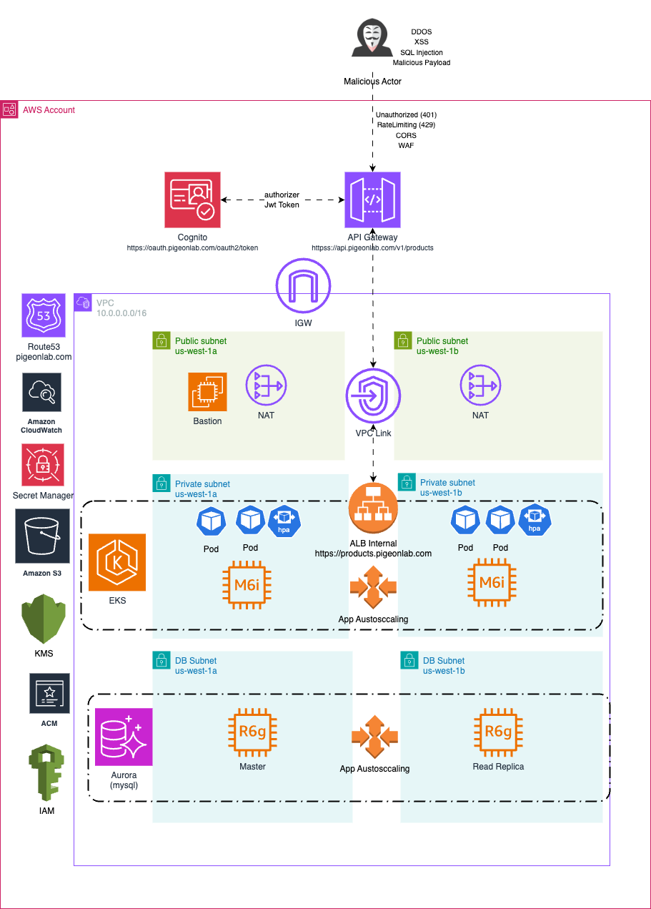
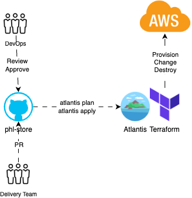
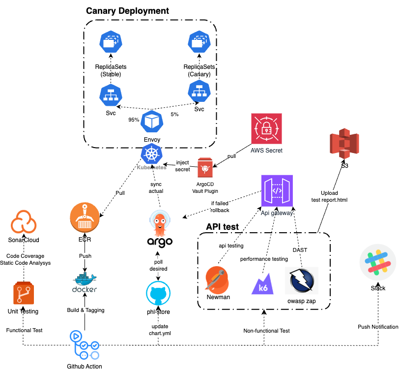

# Instructions

Starting from an AWS empty environment, setup Kubernetes cluster and Aurora MySQL cluster including all the necessary resources
using Terraform.
Next deploy a sample application phl-store to the Kubernetes Cluster (preferably with Helm). It's a simple CRUD application and should
be accessible from the outside world. The docker image URL can be found at https://hub.docker.com/r/zylwin/phl-store . The app uses
MySQL as the database to store & retrieve data. The config file is mounted as /config/config.json . The docker-compose file is
attached below for our reference.
For the application deployment, use any CI/CD tools of our choice.

# Submission

For our submission, create a private Github repository & include the following

1. Architectural diagram to explain yur architecture.
2. The relevant configuration scripts (eg: Terraform).
3. In the README, include
   a. Instruction on how to setup/run the infrastructure & deploy the app
   b. Include high level steps on how would you manage the secrets & configuration change
   c. Also include high level steps to make this infrastructure more secure, automate & reliable

# AWS Infrastructure Design

<p align="center">
  
</p>

## VPC

Our VPC is like the main highway for all our AWS stuff. It keeps everything nicely separated and secure, making sure our resources talk to each other smoothly without any unwanted visitors. We chose the CIDR block 10.0.0.0/16, which gives us plenty of IP addresses to spread out across different subnets for various needs.

To keep things running smoothly with Kubernetes in EKS, we added another CIDR block, 100.64.0.0/16, following the RFC6598 standard. This extra block is just for our Kubernetes pods, so their IPs don’t clash with the main VPC or any of our on-site networks. By having a separate range for pods, we ensure that as our cluster grows, we won’t run out of IP addresses in the main VPC.

### Subnets

We set up three kinds of subnets: public, private, and database. These are spread out over multiple Availability Zones (AZs) to make sure everything keeps running even if one zone has issues.

- **Public Subnets** are where things like NAT Gateways and Application Load Balancers (ALBs) live. These subnets have public IPs and handle internet traffic. We also use them for bastion hosts when we need secure admin access to our private resources. The ALBs help distribute traffic to our internal services, and the NAT Gateways let our private subnets reach the internet safely without being directly exposed.

- **Private Subnets** are for our important internal stuff like Kubernetes worker nodes and application pods. These don’t have direct internet access. Instead, any outgoing traffic goes through the NAT Gateways. This setup helps us scale our Kubernetes workloads easily without worrying about IP address limits, thanks to tags that help with auto-discovery and autoscaling.

- **Database Subnets** are even more locked down, used only for our Aurora databases. They’re kept separate from the rest of the traffic to keep our data safe and secure, with strict access rules in place.

### NAT Gateways

We placed NAT Gateways in the public subnets to manage internet traffic from our private resources. For our development environment, we use just one NAT Gateway to keep costs down. In production, each AZ has its own NAT Gateway to ensure high availability. This way, if one AZ or NAT Gateway has issues, the others can keep things running smoothly.

NAT Gateways are great for security because they let our private resources reach out to the internet without being directly exposed. They also automatically scale to handle more traffic as needed, which is perfect for our growing and changing architecture.

### Scalability and Availability

Our VPC is built to grow and handle failures without any hiccups. By spreading our subnets across multiple AZs, we make sure that our services stay up even if one AZ has problems. The extra CIDR block for Kubernetes means we won’t run out of IPs as we add more pods. Plus, things like NAT Gateways, ALBs, and EKS nodes can scale automatically to handle sudden increases in traffic, keeping everything fast and reliable.

### Security

Security is a top priority in our VPC design. Private subnets keep our critical resources hidden from the internet, and we use security groups and network ACLs to tightly control what traffic is allowed between resources. Our database subnets are completely isolated, making sure only the right parts of our application can talk to the database.

We use AWS KMS to encrypt sensitive data, and our ALBs have SSL certificates from AWS ACM to secure all communications. This means our data is always protected, whether it’s being stored or moving around.

Overall, our VPC setup gives us a strong, secure foundation that's ready to scale and handle any challenges. By following AWS best practices and using tools like Terraform, we've made sure our network is not only robust but also ready for the future.

## Elastic Kubernetes Service (EKS)

The EKS setup in this design is built for running containerized workloads efficiently. It takes advantage of AWS-native tools & Kubernetes features to ensure high performance, availability, & robust security. By using modules, we’ve automated many configurations, such as creating all required security groups for the control plane, nodes, & other components.

### EKS Cluster Configuration

The EKS cluster runs Kubernetes version 1.31 & is designed to operate in a private networking setup. The control plane spans multiple AZs, ensuring high availability. All communication between the control plane & worker nodes is encrypted for security.

The VPC’s subnets are configured to support the cluster’s needs:

- The control plane uses private subnets for communication, ensuring that it is isolated from public exposure.
- Worker nodes & pods run in private subnets to minimize exposure while allowing managed traffic routing through NAT Gateways & ALBs.

### Why BottleRocket?

The worker nodes in the managed node group use BottleRocket as the AMI. This is a lightweight, purpose-built OS for containerized workloads, & it comes with several advantages:

- Performance: Since it’s stripped down to just the essentials for running containers, it boots faster & uses fewer resources compared to general-purpose OSes.
- Security: BottleRocket minimizes the attack surface by removing unnecessary packages & includes built-in hardening features like kernel lockdown. It integrates seamlessly with AWS services like SSM for secure management.

### Node Groups & Autoscaling

The cluster has a managed node group for critical workloads that require high reliability. These nodes:

- Run on On-Dem& instances to ensure stability during normal traffic conditions.
- Have a fixed size (2 nodes) to avoid disruption from frequent scaling events.

For h&ling dynamic workloads, the cluster relies on Karpenter. Karpenter automatically provisions nodes based on dem&, offering rapid scaling & cost efficiency. This separation of critical & dynamic workloads ensures stability while maintaining flexibility.

### Storage & Volume Management

The setup includes EBS CSI (Container Storage Interface) for Kubernetes, which allows the cluster to provision storage dynamically. We’ve configured gp3 volumes as the default storage class. The benefits of gp3 are:

- Higher performance: With up to 3,000 IOPS & 125 MiB/s throughput, gp3 volumes provide consistent performance.
- Cost efficiency: gp3 is cheaper than gp2 for equivalent performance.
- Encryption: All volumes are encrypted using AWS KMS secure data at rest.

### Networking with VPC CNI

The cluster uses the AWS VPC CNI plugin to manage pod networking. It’s configured to use the secondary CIDR block (RFC6598, 100.64.0.0/16) to ensure there are enough IPs for pods, even in large-scale deployments. This separation also avoids conflicts with the primary CIDR & simplifies integration with on-prem networks.

The VPC CNI plugin is enhanced with:

- Prefix delegation: This increases the number of available IPs per ENI, reducing the risk of IP exhaustion.
- Custom ENI configuration: Subnets & security groups are explicitly defined, providing fine-grained control over network access.

### Add-ons for Observability & Scalability

Several add-ons are installed to enhance the functionality & observability of the cluster:

- CloudWatch Observability: Provides centralized monitoring & logging for Kubernetes workloads. This simplifies debugging & ensures better visibility into the system performance.
- CoreDNS: H&les service discovery within the cluster.
- Kube-proxy: Manages network proxying for Kubernetes services.

### IAM Integration with Pod Identity

For managing permissions, the cluster uses EKS Pod Identity instead of the traditional IAM Roles for Service Accounts (IRSA). Pod Identity provides:

- Granular permissions: Pods can assume roles with minimal required permissions, enhancing security.
- Simpler configuration: It reduces the need for managing trust relationships manually.

## ALB as Ingress Controller & API Gateway

The design is how we expose our backend APIs to the public securely & efficiently. To do this, we use AWS API Gateway combined with an internal Application Load Balancer (ALB) as an ingress controller in our EKS cluster.

### Exposing APIs with API Gateway

To make our backend APIs accessible to users, I use AWS API Gateway. This service acts as a front door for our APIs, h&ling all the incoming requests from the internet. By using API Gateway, we can easily manage & scale our API traffic without worrying about the underlying infrastructure.

### Secure Authentication with AWS Cognito

Security is a top priority, so I use AWS Cognito to h&le authentication. Cognito serves as our authorizer, ensuring that only authenticated clients can access our APIs. We set it up to use client credentials, which means that our applications need to provide valid credentials to get access tokens. This way, we keep unauthorized users out & protect our backend services from misuse.

### Integration with EKS ALB via VPC Link

Our EKS cluster uses an internal ALB as an ingress controller to manage traffic within the VPC. To connect API Gateway with this internal ALB, we use a VPC Link. This setup ensures that the API Gateway can securely route requests to our backend services running inside the EKS cluster without exposing the internal ALB to the public internet.

### Enhancing Security & Performance

To keep our application safe & perform well, I’ve added several security & performance features to API Gateway:

- Throttling Rate Limits: We set up throttling to control the number of requests a client can make in a given time period. This helps prevent abuse & ensures that our services remain available even under high load.
- CORS Configuration: Cross-Origin Resource Sharing (CORS) is configured to allow our frontend applications to interact with the API Gateway securely. This setup specifies which domains can make requests, what methods are allowed, & which headers can be used.
- Web Application Firewall (WAF): AWS WAF is integrated with API Gateway to protect our APIs from common web exploits like SQL injection & cross-site scripting. WAF rules help filter out malicious traffic before it reaches our backend services.

### Putting It All Together

By combining API Gateway with an internal ALB in EKS, & securing everything with Cognito, throttling, CORS, & WAF, we’ve built a robust & secure way to expose our backend APIs to the public. This architecture not only ensures that our APIs are safe & reliable but also makes it easy to scale & manage as our application grows.

## Aurora MySQL

Aurora MySQL is combination of performance, cost-efficiency, & MySQL compatibility. Aurora MySQL offers s built-in autoscaling for both compute & storage, making it ideal for h&ling variable workloads.

### Private Database Setup

The Aurora cluster is deployed in database subnets, ensuring that it’s not exposed to the internet. This design significantly reduces the attack surface by restricting access to internal workloads running in private subnets, such as Kubernetes pods. Only authorized resources within the VPC can communicate with the database.

### Storage Encryption with KMS

All data stored in Aurora is encrypted using AWS KMS. This ensures that sensitive information is protected at rest. The KMS key used for encryption is managed centrally, giving us control over key rotation & access policies. Encryption extends to automated backups, snapshots, & replicas, ensuring end-to-end data security.

### IAM Database Authentication

The Aurora cluster is configured with IAM database authentication, which allows us to use IAM roles for database access instead of traditional username/password credentials. This approach is more secure because:

- There’s no need to manage passwords in the application code.
- Access is tied to IAM roles, making it easier to enforce least-privilege policies & revoke access when needed.

### Autoscaling & Read Replicas

Autoscaling is enabled for the Aurora cluster, allowing it to dynamically adjust compute capacity based on traffic. This is particularly important for h&ling:

- High Traffic Spikes: During peak traffic, read replicas can scale up to h&le increased read workloads, preventing bottlenecks.
- Connection Pooling Issues: By adding more read replicas during high traffic, Aurora ensures the application doesn’t hit connection limits, improving response times & user experience.

### Read Replicas

Aurora read replicas are crucial for scaling read-heavy workloads. Traffic can be distributed across replicas using a load balancer or connection pooling strategy. This not only improves performance but also reduces the load on the primary instance, ensuring smooth operation during traffic spikes.

### Secrets Management & Rotation

The Aurora cluster’s master password is managed using AWS Secrets Manager. Secrets Manager automatically rotates the password, ensuring it’s always up-to-date & reducing the risk of credential leaks. By integrating Secrets Manager with Aurora, applications can securely retrieve database credentials without hardcoding them.

Why Automatic Rotation?

- It eliminates manual processes for updating passwords, reducing human error.
- Credentials are updated seamlessly, ensuring minimal disruption to services.

### Snapshots for Backup & Recovery

Snapshots are an integral part of this setup for disaster recovery & data retention. While Aurora automatically performs backups, manual snapshots allow us to:

- Preserve Point-in-Time Data: Snapshots capture the state of the database at a specific time, which is helpful for compliance or testing.
- Disaster Recovery: In case of accidental data loss, snapshots can be used to restore the database quickly.

### Performance Insights

Aurora is configured with Performance Insights, which provides detailed metrics for database performance. This helps in:

- Identifying slow queries or performance bottlenecks.
- Optimizing database configurations & query execution.

How to Setup/Run the Infrastructure & Deploy the App

### Prerequisites

FOr initial setup up tu run our infrastructure, we use Terraform. Here’s what we need to do:

1. Install Terraform
   Download & install Terraform from the official website.
2. Develop Terraform Code
   Write Terraform code for the AWS resources we need.
3. Run Terraform Commands
   Initialize, plan, & apply our Terraform configurations:

```sh
terraform init
terraform plan
terraform apply
```

To speed up development, I use existing AWS Terraform modules.
To check cloud resource deployment, you can see the path in this repo: `iac/deployment/cloud/`

After all main resources we need is provisioned

- [KMS](https://github.com/greyhats13/phl-store/blob/main/iac/deployment/cloud/main.tf#L2)
- [S3 tfstate](https://github.com/greyhats13/phl-store/blob/main/iac/deployment/cloud/main.tf#L23)
- [Route53](https://github.com/greyhats13/phl-store/blob/main/iac/deployment/cloud/main.tf#L23)
- [ACM](https://github.com/greyhats13/phl-store/blob/main/iac/deployment/cloud/main.tf#L65)
- [Secret Manager](https://github.com/greyhats13/phl-store/blob/main/iac/deployment/cloud/main.tf#L99)
- [VPC](https://github.com/greyhats13/phl-store/blob/main/iac/deployment/cloud/main.tf#154)
- [EKS](https://github.com/greyhats13/phl-store/blob/main/iac/deployment/cloud/main.tf#229)


ArgoCD

```hcl
module "argocd" {
  source = "../../modules/helm"
  repository       = "https://argoproj.github.io/argo-helm"
  chart            = "argo-cd"
  helm_sets_sensitive = [
    {
      name  = "configs.secret.githubSecret"
      value = random_password.argocd_github_secret.result
    },
    {
      name  = "configs.secret.extra.dex\\.github\\.clientSecret"
      value = jsondecode(data.aws_secretsmanager_secret_version.secret_iac_current.secret_string)["github_oauth_client_secret"]
    },
  ]
}
```

[ArgoCD Vault Plugin (AVP) Pod Identity](https://github.com/greyhats13/phl-store/blob/main/iac/deployment/cloud/main.tf#229)

```hcl
module "avp_custom_pod_identity" {
  association_defaults = {
    namespace       = "argocd"
    service_account = "argocd-repo-server"
  }
  source_policy_documents = [data.aws_iam_policy_document.avp_policy.json]
}
```

[Atlantis](https://github.com/greyhats13/phl-store/blob/main/iac/deployment/cloud/main.tf#L637)
```hcl
module "atlantis" {
  source = "../../modules/helm"
  repository       = "https://runatlantis.github.io/helm-charts"
  chart            = "atlantis"
  values           = ["${file("manifest/${local.atlantis_standard.Feature}.yaml")}"]
  helm_sets_sensitive = [
    {
      name  = "github.token"
      value = jsondecode(data.aws_secretsmanager_secret_version.secret_iac_current.secret_string)["github_token"]
    },
    {
      name  = "github.secret"
      value = random_password.atlantis_github_secret.result
    },
  ]
}
```

[Atlantis Pod Identity](https://github.com/greyhats13/phl-store/blob/main/iac/deployment/cloud/main.tf#L683)
```hcl
module "atlantis_custom_pod_identity" {
  association_defaults = {
    namespace       = local.atlantis_standard.Feature
    service_account = "${local.atlantis_standard.Feature}-sa"
    tags            = { App = local.atlantis_standard.Feature }
  }
  source_policy_documents = [data.aws_iam_policy_document.atlantis_policy.json]
}
```
For implementation detail, click the name.


## Prepare Manifests for Atlantis & ArgoCD

First, we need to set up manifests for Atlantis & ArgoCD. As we treat the atlantis and ArgoCD manfest as template. We can inject secrets from AWS Secret Manager into the Helm charts using the Helm provider & set `helm_sets_sensitive` to install ArgoCD.
Here's the detail of ArgoCD manifest
[atlantis.yaml](https://github.com/greyhats13/phl-store/blob/main/iac/deployment/cloud/manifest/argocd.yaml#8)
-  [Setup Github Oauth](https://github.com/greyhats13/phl-store/blob/main/iac/deployment/cloud/manifest/argocd.yaml#8)
- [Installing ArgoCD Vault Plugin](https://github.com/greyhats13/phl-store/blob/main/iac/deployment/cloud/manifest/argocd.yaml#68). ArgoCD Vault Plugin is crucial to secure our secrets. We'll discuss this in the next section.
- [Setup the ArgoCD Server Ingress](https://github.com/greyhats13/phl-store/blob/main/iac/deployment/cloud/manifest/argocd.yaml#107)

- Prepare Atlantis Manifest (iac/deployment/cloud/manifest/atlantis.yaml):
- Create Webhooks with Terraform & GitHub Provider

After installing ArgoCD Server (UI) the internet yet. We need to expose it using ALB Ingress Controller.
But before that we need to install the AWS ALB Controller first. Even we can't reach argocd server UI yet
we can access ArgoCD by creating a port-forward to the ArgoCD Server pod.
```sh
kubectl port-forward svc/argocd-server -n argocd 8080:80
```
We can start creating the ArgoCD Application for 
#### [AWS ALB Controller](https://github.com/greyhats13/phl-store/blob/main/iac/deployment/addons/aws-load-balancer-controller/main.tf#18)
- [Create the AWS ALB Controller Application in ArgoCD](https://github.com/greyhats13/phl-store/blob/main/iac/deployment/addons/aws-load-balancer-controller/main.tf#18)
2. [Prepared the manifest for the AWS ALB Controller](https://github.com/greyhats13/phl-store/blob/main/gitops/charts/addons/aws-load-balancer-controller/values.yaml#18)
3. ArgoCD will sync the changes & deploy the AWS ALB Controller to the EKS cluster.
#### [External-dns](https://github.com/greyhats13/phl-store/blob/main/iac/deployment/addons/aws-load-balancer-controller/main.tf#18)
- [Create the AWS ALB Controller Application in ArgoCD](https://github.com/greyhats13/phl-store/blob/main/iac/deployment/addons/external-dns/main.tf#19)
2. [Prepared the manifest for the AWS ALB Controller](https://github.com/greyhats13/phl-store/blob/main/gitops/charts/addons/external-dns/values.yaml#1)
3. ArgoCD will sync the changes & deploy the External-DNS to the EKS cluster.
#### Later, Karpenter

#### Expose ArgoCD and Atlantis with ALB Ingress Controller
After we install AWS ALB controller and External-DNS, our ingress will be automatically created also the record set in Route53. We can access the ArgoCD and Atlantis UI using the domain name we set in the Route53.
- We can check the annotaton setup of [argoCD Ingress here](https://github.com/greyhats13/phl-store/blob/main/iac/deployment/cloud/manifest/argocd.yaml#107)
- We can check the annotaton setup of [Atlantis Ingress here](https://github.com/greyhats13/phl-store/blob/main/iac/deployment/cloud/manifest/atlantis.yaml#40)
- Terraform will replace the placeholder with the actual values.


### Self Service Model with Atlantis

Once all components are installed, we can create a self-service model using Atlantis & GitOps. Git is the Single Source of Truth (SSoT), & all changes must go through Git. Here’s how it works:

<p align="center">
  
</p>

When we want to provision, set up, or update infrastructure, just make a pull request in the repository set up by Atlantis. 
- Developer want to provision the new service call `phl-products`. Here's for the [example](https://github.com/greyhats13/phl-store/blob/main/iac/deployment/services/phl-products#1)
- Developer also need to add this part so Atlantis can detect the changes in the directory
```yml
projects:
  - dir: iac/deployment/services/phl-profiles
    apply_requirements: ["mergeable,approved"]
    autoplan:
      when_modified: ["*.tf*"]
```

- The delivery team will create the pull request from their feature branch e.g newservices/DEV-1005 to main/master .
- Atlantis will create the autoplan for the infrastructure changes.
-  The infra or devops team reviews & approves the pull request. Let's say, we require at least two approvals & that the pull request is mergeable.
- After approval, developer can start perform the `atlantis apply` to apply the changes to the infrastructure.
- [atlantis.yaml](https://github.com/greyhats13/phl-store/blob/main/iac/atlantis.yaml#26)
```yml
version: 3
projects:
  - dir: iac/deployment/services/phl-profile
    apply_requirements: ["mergeable,approved"]
    autoplan:
      when_modified: ["*.tf*"]
```

that's how we setup the infrastructure for the new service. The same process can be applied to other services.

Check out an example that's have been done [here](https://github.com/greyhats13/phl-store/pull/36)


This part isn’t CI/CD yet, but it’s about preparing a new service. Before deploying a service on Kubernetes, We need to set up components like repository, database, users, Secrets Manager, ArgoCD Application, S3 bucket (if needed), & API Gateway integrations & routing. Doing this manually can slow things down & increase workload. So, we need a self-service model for creating new services.

With Atlantis, developers can use templates provided by devops to create new services on their own. They just fill in details like database name & access user. Terraform code will automatically add secrets to AWS Secret Manager, create ECR repository, set up ArgoCD Application, & configure API Gateway.


## Deploying Service using GitOps

To deploy our service to EKS, we need CI/CD to speed up getting our app to market. So, we use ArgoCD as our GitOps tool to deploy our service to EKS. We will design our CI/CD pipeline like the picture below.

<p align="center">
  
</p>

In this case, we use a mono repo where Terraform code, GitOps repo (Helm), & services are all stored in one repository. CI/CD triggers can vary for each community or company. Here, we use the Gitflow branching strategy. Okay, let’s continue.

From the diagram, there are 5 stages:
1. Check out code
2. Unit Test & Coverage stages (not implemented as planned)
  - Because we only have Docker images, we only see the ./app binary from the zylwin/phl-store:latest image.
  - The ideal step is we run unit tests & check coverage. 
  - GitHub Actions do the unit tests, & the reports are uploaded to artifacts for Sonar analysis. We use SonarQube for code quality & security analysis. 
3. Build & Tagging stages
  - Here, GitHub Actions build Docker images 
  - Tag them with the image SHA based on push events to the master or dev branch.
  - After tagging, the images are pushed to the ECR registry. Authentication is done using GitHub OIDC.
- Deployment with ArgoCD
  - In this step, deployment happens after GitHub Actions have pushed the image tags.
  - ArgoCD clones the repository & uses sed to replace the image tag with the pushed image SHA in the Helm chart.
  - Github action will replace appVersion in Chart.yaml with the new image tag. 
  - ArgoCD then detect the the change & syncs the desired state with the live state in EKS. Ideally, we use canary deployments, but due to time constraints, we do a rolling update instead.

4. End to End Testing
  - API Testing with Newman
  - We use a Postman collection with pre-request & post-response scripts.
  - Since our endpoint needs Authorization, we generate a Bearer Token by hitting the oauth.phl.blast.co.id endpoint.
  - This endpoint is a custom domain from Cognito, which acts as the authorizer for our AWS API Gateway.
  - After getting the token, we save it to a Postman environment variable.
  - Then, we run the Postman collection with Newman for 5 iterations & a 200ms delay between each.
b. Performance Testing with k6.io
  - We set up performance testing scenarios & develop a k6.js script.
  - Then, we run k6.io with 5 iterations & a 200ms delay between each.
c. Security Testing with OWASP ZAP
  - We perform security testing with OWASP ZAP by preparing the OpenAPI spec of our service.
  - Using the Bearer Token saved in $GITHUB_ENV, we run OWASP ZAP.
  - After all tests, we upload the test reports to an S3 bucket.

Reference: [profile-ci.yml](https://github.com/greyhats13/phl-store/blob/main/.github/workflows/products-ci.yml#L1)

# Securing the Application Secret

There are many ways to secure secrets. We can use AWS Secret Store CSI Driver, External Secret, or ArgoCD Vault Plugin (AVP). Here’s the high-level design:

<p align="center">
  
</p>

## Preparation
We will secure secrets using ArgoCD Vault Plugin (AVP) with AWS Secrets Manager. Here are the steps:
1.	Install ArgoCD & AVP on EKS
- We already installed ArgoCD on our EKS cluster & added the ArgoCD Vault Plugin (AVP).
2.	Set Up IAM Policy for AVP
- To use AVP, ArgoCD repo server needs permission to read secrets from Secrets Manager. First, we create an IAM policy:

[ArgoCD Vault Plugin IAM Policy](https://github.com/greyhats13/phl-store/blob/main/iac/deployment/cloud/iam_policies.tf#L27)
```hcl
data "aws_iam_policy_document" "avp_policy" {
  statement {
    actions = [
      "secretsmanager:GetSecretValue",
    ]

    resources = [
      "*",
    ]
  }
}
```

**3**	Attach IAM Policy to ArgoCD Repo Server
- Next, we attach this policy to the IAM Role used by argocd-repo-server & associate the IAM Role with the Kubernetes service account.
[ArgoCD Vault Plugin IAM Policy](https://github.com/greyhats13/phl-store/blob/main/iac/deployment/cloud/main.tf#L609)
```hcl
module "avp_custom_pod_identity" {
  source  = "terraform-aws-modules/eks-pod-identity/aws"
  version = "~> 1.7.0"

  name            = "avp_role"
  use_name_prefix = false

  # ArgoCD Vault Plugin (AVP) is installed in the argocd-repo-server
  # So we need to attach the policy to the argocd-repo-server service account
  association_defaults = {
    namespace       = "argocd"
    service_account = "argocd-repo-server"
    tags            = { App = "avp" }
  }

  associations = {
    main = {
      cluster_name = module.eks_main.cluster_name
    }
  }

  attach_custom_policy    = true
  source_policy_documents = [data.aws_iam_policy_document.avp_policy.json]

  tags = local.tags
}
```

**4.**	Create Secret Template for Helm Chart
Now, AVP can read secrets from AWS Secrets Manager. We need to create a secret.yaml template for our Helm chart.
[secret.yaml]https://github.com/greyhats13/phl-store/blob/main/gitops/charts/app/phl-products/templates/secret.yaml#L27)
```yaml
apiVersion: v1
kind: Secret
metadata:
  name: {{ .Release.Name }}
  namespace: {{ .Release.Namespace }}
  {{- if .Values.appSecret.annotations }}
  annotations:
    {{- toYaml .Values.appSecret.annotations | nindent 4 }}
  {{- end }}
type: Opaque
stringData:
  config.json: |-
    {
    {{- $secretMap := .Values.appSecret.secrets }}
    {{- $count := len $secretMap }}
    {{- $i := 0 }}
    {{- range $key, $val := $secretMap }}
      "{{ $key }}": "{{ $val }}"{{- if lt (add1 $i) $count }},{{ end }}
      {{- $i = add1 $i }}
    {{- end }}
    }
```
In this manifest, we allow values.yaml to accept appSecret. Our service phl-products reads secrets from this file, so we need to create stringData & convert key-value secrets from Secrets Manager into JSON.

```yaml
stringData:
  config.json: |-
    {
    {{- $secretMap := .Values.appSecret.secrets }}
    {{- $count := len $secretMap }}
    {{- $i := 0 }}
    {{- range $key, $val := $secretMap }}
      "{{ $key }}": "{{ $val }}"{{- if lt (add1 $i) $count }},{{ end }}
      {{- $i = add1 $i }}
    {{- end }}
    }
```
5.	Prepare Secret Annotations in values.yaml
We also need to set up secret annotations in values.yaml to tell AVP where to find the secrets.
```yaml
appSecret:
  annotations:
    avp.kubernetes.io/path: "phl/svc/phl-products"
    avp.kubernetes.io/secret-version: "AWSCURRENT"
  secrets:
    connection_string: <connection_string>
    port: <port>
```

```yaml
    avp.kubernetes.io/path: This is the name of our secret in AWS.
    avp.kubernetes.io/secret-version: This is the latest version of our secret.
```
**6.** Replace Placeholders with Secrets
When ArgoCD syncs, it replaces the placeholders with values from Secrets Manager.
**7.**	Use Distroless Image for Security
To make secrets more secure, use a distroless image for our service. This way, no one can access secrets from the container.
```Dockerfile
# Use a minimal base image for distroless
FROM gcr.io/distroless/static:nonroot

COPY /usr/share/zoneinfo /usr/share/zoneinfo

# Copy the binary into the image
COPY ./app /build/app

EXPOSE 8080

# Run the binary
CMD ["/build/app"]
```

We set up a GitOps pipeline using ArgoCD to deploy services to EKS. Our CI/CD pipeline includes building & tagging Docker images, deploying with ArgoCD, & running end-to-end tests. We also secured our application secrets using ArgoCD Vault Plugin with AWS Secrets Manager. This setup helps us deploy quickly, keep our services secure, & maintain a smooth workflow for our developers.
