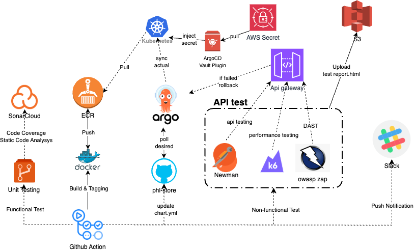

# Instructions

Starting from an AWS empty environment, setup Kubernetes cluster and Aurora MySQL cluster including all the necessary resources
using Terraform.
Next deploy a sample application phl-store to the Kubernetes Cluster (preferably with Helm). It's a simple CRUD application and should
be accessible from the outside world. The docker image URL can be found at https://hub.docker.com/r/zylwin/phl-store . The app uses
MySQL as the database to store & retrieve data. The config file is mounted as /config/config.json . The docker-compose file is
attached below for our reference.
For the application deployment, use any CI/CD tools of our choice.

# Submission

For our submission, create a private Github repository & include the following

1. Architectural diagram to explain yur architecture.
2. The relevant configuration scripts (eg: Terraform).
3. In the README, include
   a. Instruction on how to setup/run the infrastructure & deploy the app
   b. Include high level steps on how would you manage the secrets & configuration change
   c. Also include high level steps to make this infrastructure more secure, automate & reliable

# AWS Infrastructure Design

<p align="center">
  
</p>

## VPC

Our VPC is the heart of our AWS setup. It makes sure all our AWS resources can talk to each other securely & work well together. We designed the VPC to be scalable, highly available, high-performing, secure, & cost-effective.

### Core Design

- Scalable: We use a CIDR block of 10.0.0.0/16 which gives us lots of IP addresses. This helps us add more resources easily as we grow. We also added second CIDR block 100.64.0.0/16 for Kubernetes pods. This keeps pod IPs separate & avoids conflicts, so we never run out of IPs as our cluster gets bigger.
- Highly Available: Our VPC spreads resources across multiple Availability Zones (AZs). This means if one AZ has problems, our services stay up & running in other AZs. No single point of failure!
- High Performance: We use AWS services like NAT Gateways & Application Load Balancers (ALBs) to ensure fast & reliable communication between our resources. This setup helps keep our applications running smoothly.
- Secure: Security is a top priority. We isolate critical resources in private subnets & use security groups & network ACLs to control who can access what. Data is encrypted both in transit & at rest using AWS KMS & SSL certificates.
- Cost Optimized: We balance performance & cost by using resources wisely. For example, we use one NAT Gateway in development to save money & multiple NAT Gateways in production for reliability.

### Subnet Design

Our VPC has three types of subnets, each with a specific role. These subnets are spread across different AZs to keep things running even if one AZ fails.

- Public Subnets:
- Purpose: Host internet-facing services like NAT Gateways, ALBs, & bastion hosts for secure admin access.
- Interaction: ALBs h&le incoming internet traffic & send it to our internal services. NAT Gateways let our private resources access the internet securely without being exposed directly.
- Setup: These subnets have public IPs & proper routing to manage both incoming & outgoing internet traffic.
- Private Subnets:
- Purpose: Hold important internal resources like EKS worker nodes & application pods.
- Interaction: These resources don’t have direct internet access. They use NAT Gateways to go out when needed. Tags like kubernetes.io/role/internal-elb help Kubernetes manage internal load balancers, & karpenter.sh/discovery helps with autoscaling.
- Setup: Private subnets keep our critical resources secure & allow them to scale easily as dem& grows.
- Database Subnets:
- Purpose: Only for our Aurora database instances.
- Interaction: These subnets are extra secure & separate from other traffic. Only authorized application workloads can talk to the databases.
- Setup: Strict access controls keep our databases safe from unauthorized access.

### NAT Gateways

We use NAT Gateways to manage outbound internet traffic from our private subnets.

- Development: One NAT Gateway helps keep costs low.
- Production: Each AZ has its own NAT Gateway for better reliability. If one AZ or NAT Gateway fails, others keep working.

NAT Gateways are important because they let our private resources access the internet securely without being exposed. They also scale automatically to h&le more traffic when needed.

Why This VPC Design Works

- Scalability: With a large IP range & separate blocks for pods, we can keep adding more resources without running out of IPs. Our setup supports growing workloads without issues.
- High Availability: By spreading subnets across multiple AZs, our services stay available even if one AZ has problems. This makes our system more resilient.
- High Performance: Using AWS services like NAT Gateways & ALBs ensures that our resources communicate quickly & reliably. This keeps our applications running smoothly.
- Security: Private subnets & strict access controls keep our important resources safe from the internet. Encryption protects our data both when it’s stored & when it’s moving around.
- Cost Optimization: We save money by using fewer NAT Gateways in development & scaling them in production as needed. This way, we get the best performance without overspending.

### Security Measures

Security is built into every part of our VPC:

- Network Isolation: Private subnets keep critical resources hidden from the internet. Only necessary services are in public subnets.
- Access Controls: Security groups & network ACLs control who can access what. Only allowed traffic can move between resources.
- Data Encryption: We use AWS KMS to encrypt sensitive data at rest. ALBs use SSL certificates from AWS ACM to secure data in transit.
- Managed Security Services: Tools like AWS WAF protect our APIs from common web attacks, adding an extra layer of security.

## Elastic Kubernetes Service (EKS)

The EKS setup in this design is built for running containerized workloads efficiently. It takes advantage of AWS-native tools & Kubernetes features to ensure high performance, availability, & robust security. By using modules, we’ve automated many configurations, such as creating all required security groups for the control plane, nodes, & other components.

### EKS Cluster Configuration

The EKS cluster runs Kubernetes version 1.31 & is designed to operate in a private networking setup. The control plane spans multiple AZs, ensuring high availability. All communication between the control plane & worker nodes is encrypted for security.

The VPC’s subnets are configured to support the cluster’s needs:

- The control plane uses private subnets for communication, ensuring that it is isolated from public exposure.
- Worker nodes & pods run in private subnets to minimize exposure while allowing managed traffic routing through NAT Gateways & ALBs.

### Why BottleRocket?

The worker nodes in the managed node group use BottleRocket as the AMI. This is a lightweight, purpose-built OS for containerized workloads, & it comes with several advantages:

- Performance: Since it’s stripped down to just the essentials for running containers, it boots faster & uses fewer resources compared to general-purpose OSes.
- Security: BottleRocket minimizes the attack surface by removing unnecessary packages & includes built-in hardening features like kernel lockdown. It integrates seamlessly with AWS services like SSM for secure management.

### Node Groups & Autoscaling

The cluster has a managed node group for critical workloads that require high reliability. These nodes:

- Run on On-Dem& instances to ensure stability during normal traffic conditions.
- Have a fixed size (2 nodes) to avoid disruption from frequent scaling events.

For h&ling dynamic workloads, the cluster relies on Karpenter. Karpenter automatically provisions nodes based on dem&, offering rapid scaling & cost efficiency. This separation of critical & dynamic workloads ensures stability while maintaining flexibility.

### Storage & Volume Management

The setup includes EBS CSI (Container Storage Interface) for Kubernetes, which allows the cluster to provision storage dynamically. We’ve configured gp3 volumes as the default storage class. The benefits of gp3 are:

- Higher performance: With up to 3,000 IOPS & 125 MiB/s throughput, gp3 volumes provide consistent performance.
- Cost efficiency: gp3 is cheaper than gp2 for equivalent performance.
- Encryption: All volumes are encrypted using AWS KMS secure data at rest.

### Networking with VPC CNI

The cluster uses the AWS VPC CNI plugin to manage pod networking. It’s configured to use the secondary CIDR block (RFC6598, 100.64.0.0/16) to ensure there are enough IPs for pods, even in large-scale deployments. This separation also avoids conflicts with the primary CIDR & simplifies integration with on-prem networks.

The VPC CNI plugin is enhanced with:

- Prefix delegation: This increases the number of available IPs per ENI, reducing the risk of IP exhaustion.
- Custom ENI configuration: Subnets & security groups are explicitly defined, providing fine-grained control over network access.

### Add-ons for Observability & Scalability

Several add-ons are installed to enhance the functionality & observability of the cluster:

- CloudWatch Observability: Provides centralized monitoring & logging for Kubernetes workloads. This simplifies debugging & ensures better visibility into the system performance.
- CoreDNS: H&les service discovery within the cluster.
- Kube-proxy: Manages network proxying for Kubernetes services.

### IAM Integration with Pod Identity

For managing permissions, the cluster uses EKS Pod Identity instead of the traditional IAM Roles for Service Accounts (IRSA). Pod Identity provides:

- Granular permissions: Pods can assume roles with minimal required permissions, enhancing security.
- Simpler configuration: It reduces the need for managing trust relationships manually.

## ALB as Ingress Controller & API Gateway

The design is how we expose our backend APIs to the public securely & efficiently. To do this, we use AWS API Gateway combined with an internal Application Load Balancer (ALB) as an ingress controller in our EKS cluster.

### Exposing APIs with API Gateway

To make our backend APIs accessible to users, I use AWS API Gateway. This service acts as a front door for our APIs, h&ling all the incoming requests from the internet. By using API Gateway, we can easily manage & scale our API traffic without worrying about the underlying infrastructure.

### Secure Authentication with AWS Cognito

Security is a top priority, so I use AWS Cognito to h&le authentication. Cognito serves as our authorizer, ensuring that only authenticated clients can access our APIs. We set it up to use client credentials, which means that our applications need to provide valid credentials to get access tokens. This way, we keep unauthorized users out & protect our backend services from misuse.

### Integration with EKS ALB via VPC Link

Our EKS cluster uses an internal ALB as an ingress controller to manage traffic within the VPC. To connect API Gateway with this internal ALB, we use a VPC Link. This setup ensures that the API Gateway can securely route requests to our backend services running inside the EKS cluster without exposing the internal ALB to the public internet.

### Enhancing Security & Performance

To keep our application safe & perform well, I’ve added several security & performance features to API Gateway:

- Throttling Rate Limits: We set up throttling to control the number of requests a client can make in a given time period. This helps prevent abuse & ensures that our services remain available even under high load.
- CORS Configuration: Cross-Origin Resource Sharing (CORS) is configured to allow our frontend applications to interact with the API Gateway securely. This setup specifies which domains can make requests, what methods are allowed, & which headers can be used.
- Web Application Firewall (WAF): AWS WAF is integrated with API Gateway to protect our APIs from common web exploits like SQL injection & cross-site scripting. WAF rules help filter out malicious traffic before it reaches our backend services.

### Putting It All Together

By combining API Gateway with an internal ALB in EKS, & securing everything with Cognito, throttling, CORS, & WAF, we’ve built a robust & secure way to expose our backend APIs to the public. This architecture not only ensures that our APIs are safe & reliable but also makes it easy to scale & manage as our application grows.

## Aurora MySQL

Aurora MySQL is combination of performance, cost-efficiency, & MySQL compatibility. Aurora MySQL offers s built-in autoscaling for both compute & storage, making it ideal for h&ling variable workloads.

### Private Database Setup

The Aurora cluster is deployed in database subnets, ensuring that it’s not exposed to the internet. This design significantly reduces the attack surface by restricting access to internal workloads running in private subnets, such as Kubernetes pods. Only authorized resources within the VPC can communicate with the database.

### Storage Encryption with KMS

All data stored in Aurora is encrypted using AWS KMS. This ensures that sensitive information is protected at rest. The KMS key used for encryption is managed centrally, giving us control over key rotation & access policies. Encryption extends to automated backups, snapshots, & replicas, ensuring end-to-end data security.

### IAM Database Authentication

The Aurora cluster is configured with IAM database authentication, which allows us to use IAM roles for database access instead of traditional username/password credentials. This approach is more secure because:

- There’s no need to manage passwords in the application code.
- Access is tied to IAM roles, making it easier to enforce least-privilege policies & revoke access when needed.

### Autoscaling & Read Replicas

Autoscaling is enabled for the Aurora cluster, allowing it to dynamically adjust compute capacity based on traffic. This is particularly important for h&ling:

- High Traffic Spikes: During peak traffic, read replicas can scale up to h&le increased read workloads, preventing bottlenecks.
- Connection Pooling Issues: By adding more read replicas during high traffic, Aurora ensures the application doesn’t hit connection limits, improving response times & user experience.

### Read Replicas

Aurora read replicas are crucial for scaling read-heavy workloads. Traffic can be distributed across replicas using a load balancer or connection pooling strategy. This not only improves performance but also reduces the load on the primary instance, ensuring smooth operation during traffic spikes.

### Secrets Management & Rotation

The Aurora cluster’s master password is managed using AWS Secrets Manager. Secrets Manager automatically rotates the password, ensuring it’s always up-to-date & reducing the risk of credential leaks. By integrating Secrets Manager with Aurora, applications can securely retrieve database credentials without hardcoding them.

Why Automatic Rotation?

- It eliminates manual processes for updating passwords, reducing human error.
- Credentials are updated seamlessly, ensuring minimal disruption to services.

### Snapshots for Backup & Recovery

Snapshots are an integral part of this setup for disaster recovery & data retention. While Aurora automatically performs backups, manual snapshots allow us to:

- Preserve Point-in-Time Data: Snapshots capture the state of the database at a specific time, which is helpful for compliance or testing.
- Disaster Recovery: In case of accidental data loss, snapshots can be used to restore the database quickly.

### Performance Insights

Aurora is configured with Performance Insights, which provides detailed metrics for database performance. This helps in:

- Identifying slow queries or performance bottlenecks.
- Optimizing database configurations & query execution.

How to Setup/Run the Infrastructure & Deploy the App

### Prerequisites

FOr initial setup up tu run our infrastructure, we use Terraform. Here’s what we need to do:

1. Install Terraform
   Download & install Terraform from the official website.
2. Develop Terraform Code
   Write Terraform code for the AWS resources we need.
3. Run Terraform Commands
   Initialize, plan, & apply our Terraform configurations:

```sh
terraform init
terraform plan
terraform apply
```

To speed up development, I use existing AWS Terraform modules.
To check cloud resource deployment, you can see the path in this repo: `iac/deployment/cloud/`

After all main resources we need is provisioned
- [KMS](https://github.com/greyhats13/phl-store/blob/main/iac/deployment/cloud/main.tf#L2)
- [S3 tfstate](https://github.com/greyhats13/phl-store/blob/main/iac/deployment/cloud/main.tf#L23)
- [Route53](https://github.com/greyhats13/phl-store/blob/main/iac/deployment/cloud/main.tf#L23)
- [Route53](https://github.com/greyhats13/phl-store/blob/main/iac/deployment/cloud/main.tf#L65)
- [Secret Manager](https://github.com/greyhats13/phl-store/blob/main/iac/deployment/cloud/main.tf#L99)
- [VPC](https://github.com/greyhats13/phl-store/blob/main/iac/deployment/cloud/main.tf#154)

I started installing the EKS addons with their EKS Pods Identity (IRSA replacement) such as
[ArgoCD](https://github.com/greyhats13/phl-store/blob/main/iac/deployment/cloud/main.tf#L556)

```hcl
module "argocd" {
  source = "../../modules/helm"
  chart            = "argo-cd"
  values           = ["${file("manifest/${local.argocd_standard.Feature}.yaml")}"]
}
```

and

[Atlantis](https://github.com/greyhats13/phl-store/blob/main/iac/deployment/cloud/main.tf#L637)

```hcl
# Atlantis
module "atlantis" {
  repository       = "https://runatlantis.github.io/helm-charts"
  chart            = "atlantis"
}
```

Terraform Provider Setup

- Deploy Atlantis & ArgoCD on EKS
  Use the Helm provider to install Atlantis & ArgoCD on our EKS cluster. Make sure aws-alb-ingress-controller & external-dns are installed on the EKS cluster. This allows ALB Ingress Controller to create ALBs & External DNS to automatically create Route53 records.
  [Module ArgoCD](https://github.com/greyhats13/phl-store/blob/main/iac/deployment/cloud/main.tf#L556) & [Module atlantis](https://github.com/greyhats13/phl-store/blob/main/iac/deployment/cloud/main.tf#L637)
- Create IAM Provider
- Set up IAM roles & policies for Atlantis & ArgoCD. we can use EKS Pod Identity or IRSA. Here, we use EKS Pod Identity. Ensure the ArgoCD and service account name match the one associated with the pod identity.

## Prepare Manifests for Atlantis & ArgoCD

First, we need to set up manifests for Atlantis & ArgoCD. We can inject secrets from AWS Secret Manager into the Helm charts using the Helm provider & set `helm_sets_sensitive` to install ArgoCD.

- Prepare Atlantis Manifest (iac/deployment/cloud/manifest/atlantis.yaml):
- Create Webhooks with Terraform & GitHub Provider

### Self Service Model with Atlantis

Once all components are installed, we can create a self-service model using Atlantis & GitOps. Git is the Single Source of Truth (SSoT), & all changes must go through Git. Here’s how it works:

<p align="center">
  
</p>

When we want to provision, set up, or update infrastructure, just make a pull request in the repository set up by Atlantis. The infra or devops team reviews & approves the pull request. We require at least two approvals & that the pull request is mergeable. After approval, Atlantis applies the infrastructure defined in the pull request.

````yml
version: 3
projects:
  - dir: iac/deployment/services/phl-profile
    apply_requirements: ["mergeable,approved"]
    autoplan:
      when_modified: ["*.tf*"]
```

Check out an example pull request here:
https://github.com/greyhats13/phl-store/pull/36

### Example Service Deployment

This part isn’t CI/CD yet, but it’s about preparing a new service. Before deploying a service on Kubernetes, we need to set up components like repository, database, users, Secrets Manager, ArgoCD Application, S3 bucket (if needed), & API Gateway integrations & routing. Doing this manually can slow things down & increase workload. So, we need a self-service model for creating new services.

With Atlantis, developers can use templates provided by devops to create new services on their own. They just fill in details like database name & access user. Terraform code will automatically add secrets to AWS Secret Manager, create ECR repository, set up ArgoCD Application, & configure API Gateway.
```hcl
// Databases Config
// Create a Database
resource "mysql_database" "db" {
  name = local.svc_naming_st&ard
}

## Create a Database User
resource "mysql_user" "db" {
  user               = local.svc_naming_st&ard
  host               = "%"
  plaintext_password = r&om_password.password.result
}

## Grant the user access to the database
resource "mysql_grant" "db" {
  user       = mysql_user.db.user
  host       = mysql_user.db.host
  database   = mysql_database.db.name
  privileges = ["CREATE", "SELECT", "INSERT", "UPDATE", "DELETE"]
}

# Secrets Manager
## Create Secrets Manager
module "secrets_iac" {
  source  = "terraform-aws-modules/secrets-manager/aws"
  version = "~> 1.3.1"

  name                    = local.svc_secret_st&ard
  description             = "Secrets for ${local.svc_secret_st&ard}"
  recovery_window_in_days = 0
  create_policy           = true
  block_public_policy     = true
  policy_statements = {
    admin = {
      sid = "IacSecretAdmin"
      principals = [
        {
          type        = "AWS"
          identifiers = ["arn:aws:iam::${data.aws_caller_identity.current.account_id}:root"]
        },
        {
          type        = "AWS"
          identifiers = ["arn:aws:iam::${data.aws_caller_identity.current.account_id}:user/imam.arief.rhmn@gmail.com"]
        },
        {
          type        = "AWS"
          identifiers = ["arn:aws:iam::${data.aws_caller_identity.current.account_id}:user/idanfreak@gmail.com"]
        },
        {
          type        = "AWS"
          identifiers = ["arn:aws:iam::${data.aws_caller_identity.current.account_id}:role/iac"]
        },
      ]
      actions   = ["secretsmanager:GetSecretValue"]
      resources = ["*"]
    }
  }

  ignore_secret_changes = false
  secret_string = jsonencode({
    connection_string = "${mysql_user.db.user}:${r&om_password.password.result}@tcp(${data.terraform_remote_state.cloud.outputs.aurora_cluster_endpoint}:${data.terraform_remote_state.cloud.outputs.aurora_cluster_port})/${mysql_database.db.name}"
    port              = "8080"
  })

  tags = merge(local.tags, local.svc_st&ard)
}

# CI/CD Components
module "ecr" {
  source  = "terraform-aws-modules/ecr/aws"
  version = "~> 2.3.0"

  repository_name = local.svc_naming_st&ard
  repository_read_write_access_arns = [
    "arn:aws:iam::${data.aws_caller_identity.current.account_id}:role/iac",
    "arn:aws:iam::${data.aws_caller_identity.current.account_id}:role/atlantis-role",
    "arn:aws:iam::${data.aws_caller_identity.current.account_id}:role/github",
    "arn:aws:iam::${data.aws_caller_identity.current.account_id}:root"
  ]
  repository_image_tag_mutability = "MUTABLE"
  repository_lifecycle_policy = jsonencode({
    rules = [
      {
        rulePriority = 1,
        description  = "Keep last 30 images",
        selection = {
          tagStatus     = "tagged",
          tagPrefixList = ["v"],
          countType     = "imageCountMoreThan",
          countNumber   = 30
        },
        action = {
          type = "expire"
        }
      }
    ]
  })
  manage_registry_scanning_configuration = true
  registry_scan_type                     = "BASIC"
  registry_scan_rules = [
    {
      scan_frequency = "SCAN_ON_PUSH"
      filter = [
        {
          filter      = "phl-*"
          filter_type = "WILDCARD"
        }
      ]
    }
  ]
  repository_encryption_type = "KMS"
  repository_kms_key         = data.terraform_remote_state.cloud.outputs.main_key_arn
  tags = {
    Terraform   = "true"
    Environment = "dev"
  }
}

// Prepare GitHub
module "github_action_env" {
  source                  = "../../../modules/github"
  repo_name               = var.github_repo
  owner                   = var.github_owner
  svc_name                = local.svc_naming_st&ard
  github_action_variables = local.github_action_variables
  github_action_secrets   = local.github_action_secrets
}

// ArgoCD Vault Plugin (AVP) Pod Identity
module "svc_custom_pod_identity" {
  source  = "terraform-aws-modules/eks-pod-identity/aws"
  version = "~> 1.7.0"

  name            = local.svc_naming_full
  use_name_prefix = false

  association_defaults = {
    namespace       = "app"
    service_account = local.svc_naming_full
    tags            = { App = "${local.svc_st&ard.Feature}" }
  }

  associations = {
    main = {
      cluster_name = data.terraform_remote_state.cloud.outputs.eks_cluster_name
    }
  }

  attach_custom_policy    = true
  source_policy_documents = [data.aws_iam_policy_document.svc_policy.json]

  tags = local.tags
}

// Create ArgoCD App
module "argocd_app" {
  source     = "../../../modules/helm"
  region     = var.region
  st&ard   = local.svc_st&ard
  repository = "https://argoproj.github.io/argo-helm"
  chart      = "argocd-apps"
  values     = [file("manifest/${local.svc_st&ard.Feature}.yaml")]
  namespace  = "argocd"
  dns_name   = "${local.svc_st&ard.Feature}.${var.unit}.blast.co.id"
  extra_vars = {
    argocd_namespace                       = "argocd"
    source_repoURL                         = "git@github.com:${var.github_owner}/${var.github_repo}.git"
    source_targetRevision                  = "HEAD"
    source_path                            = "gitops/charts/app/${local.svc_name}"
    project                                = "default"
    destination_server                     = "https://kubernetes.default.svc"
    destination_namespace                  = var.env
    avp_type                               = "awssecretsmanager"
    region                                 = var.region
    syncPolicy_automated_prune             = true
    syncPolicy_automated_selfHeal          = true
    syncPolicy_syncOptions_CreateNamespace = true
  }
}

module "api_integration_routes" {
  source = "../../../modules/api"

  existing_gateway_id            = data.terraform_remote_state.cloud.outputs.api_id
  create_domain_name             = false
  create_certificate             = false
  create_stage                   = false
  deploy_stage                   = true
  create_routes_&_integrations = true
  routes = {
    "GET /${local.svc_st&ard.Feature}" = {
      authorization_type     = "JWT"
      authorizer_key         = "cognito-authorizer"
      authorizer_id          = data.terraform_remote_state.cloud.outputs.api_authorizers["cognito"]["id"]
      authorization_scopes   = data.terraform_remote_state.cloud.outputs.cognito_authrization_scopes
      throttling_rate_limit  = 80
      throttling_burst_limit = 40

      integration = {
        connection_type = "VPC_LINK"
        connection_id   = data.terraform_remote_state.cloud.outputs.api_vpc_links["vpc-main"]["id"]
        type            = "HTTP_PROXY"
        method          = "GET"
        uri             = data.aws_lb_listener.listener.arn
        tls_config = {
          server_name_to_verify = "${local.svc_st&ard.Feature}.${data.terraform_remote_state.cloud.outputs.dns_name}"
        }
        request_parameters = {
          "overwrite:header.Host" = "${local.svc_st&ard.Feature}.${data.terraform_remote_state.cloud.outputs.dns_name}"
          "overwrite:path"        = "/api/${local.svc_st&ard.Feature}"
        }
      }
    }

    "POST /${local.svc_st&ard.Feature}" = {
      authorization_type     = "JWT"
      authorizer_key         = "cognito-authorizer"
      authorizer_id          = data.terraform_remote_state.cloud.outputs.api_authorizers["cognito"]["id"]
      authorization_scopes   = data.terraform_remote_state.cloud.outputs.cognito_authrization_scopes
      throttling_rate_limit  = 80
      throttling_burst_limit = 40

      integration = {
        connection_type = "VPC_LINK"
        connection_id   = data.terraform_remote_state.cloud.outputs.api_vpc_links["vpc-main"]["id"]
        type            = "HTTP_PROXY"
        method          = "POST"
        uri             = data.aws_lb_listener.listener.arn
        tls_config = {
          server_name_to_verify = "${local.svc_st&ard.Feature}.${data.terraform_remote_state.cloud.outputs.dns_name}"
        }
        request_parameters = {
          "overwrite:header.Host" = "${local.svc_st&ard.Feature}.${data.terraform_remote_state.cloud.outputs.dns_name}"
          "overwrite:path"        = "/api/${local.svc_st&ard.Feature}"
        }
        response_parameters = [
          {
            status_code = 200
            mappings = {
              "overwrite:statuscode" = "201"
            }
          }
        ]
      }
    }

    "GET /${local.svc_st&ard.Feature}/{id}" = {
      authorization_type     = "JWT"
      authorizer_key         = "cognito-authorizer"
      authorizer_id          = data.terraform_remote_state.cloud.outputs.api_authorizers["cognito"]["id"]
      authorization_scopes   = data.terraform_remote_state.cloud.outputs.cognito_authrization_scopes
      throttling_rate_limit  = 80
      throttling_burst_limit = 40

      integration = {
        connection_type = "VPC_LINK"
        connection_id   = data.terraform_remote_state.cloud.outputs.api_vpc_links["vpc-main"]["id"]
        type            = "HTTP_PROXY"
        method          = "GET"
        uri             = data.aws_lb_listener.listener.arn
        tls_config = {
          server_name_to_verify = "${local.svc_st&ard.Feature}.${data.terraform_remote_state.cloud.outputs.dns_name}"
        }
        request_parameters = {
          "overwrite:header.Host" = "${local.svc_st&ard.Feature}.${data.terraform_remote_state.cloud.outputs.dns_name}"
          "overwrite:path"        = "/api/${local.svc_st&ard.Feature}/$request.path.id"
        }
      }
    }

    "PUT /${local.svc_st&ard.Feature}/{id}" = {
      authorization_type     = "JWT"
      authorizer_key         = "cognito-authorizer"
      authorizer_id          = data.terraform_remote_state.cloud.outputs.api_authorizers["cognito"]["id"]
      authorization_scopes   = data.terraform_remote_state.cloud.outputs.cognito_authrization_scopes
      throttling_rate_limit  = 80
      throttling_burst_limit = 40

      integration = {
        connection_type = "VPC_LINK"
        connection_id   = data.terraform_remote_state.cloud.outputs.api_vpc_links["vpc-main"]["id"]
        type            = "HTTP_PROXY"
        method          = "PUT"
        uri             = data.aws_lb_listener.listener.arn
        tls_config = {
          server_name_to_verify = "${local.svc_st&ard.Feature}.${data.terraform_remote_state.cloud.outputs.dns_name}"
        }
        request_parameters = {
          "overwrite:header.Host" = "${local.svc_st&ard.Feature}.${data.terraform_remote_state.cloud.outputs.dns_name}"
          "overwrite:path"        = "/api/${local.svc_st&ard.Feature}/$request.path.id"
        }
      }
    }

    "DELETE /${local.svc_st&ard.Feature}/{id}" = {
      authorization_type     = "JWT"
      authorizer_key         = "cognito-authorizer"
      authorizer_id          = data.terraform_remote_state.cloud.outputs.api_authorizers["cognito"]["id"]
      authorization_scopes   = data.terraform_remote_state.cloud.outputs.cognito_authrization_scopes
      throttling_rate_limit  = 80
      throttling_burst_limit = 40

      integration = {
        connection_type = "VPC_LINK"
        connection_id   = data.terraform_remote_state.cloud.outputs.api_vpc_links["vpc-main"]["id"]
        type            = "HTTP_PROXY"
        method          = "DELETE"
        uri             = data.aws_lb_listener.listener.arn
        tls_config = {
          server_name_to_verify = "${local.svc_st&ard.Feature}.${data.terraform_remote_state.cloud.outputs.dns_name}"
        }
        request_parameters = {
          "overwrite:header.Host" = "${local.svc_st&ard.Feature}.${data.terraform_remote_state.cloud.outputs.dns_name}"
          "overwrite:path"        = "/api/${local.svc_st&ard.Feature}/$request.path.id"
        }
        response_parameters = [
          {
            status_code = 200
            mappings = {
              "overwrite:statuscode" = "204"
            }
          }
        ]
      }
    }
    "$default" = {
      integration = {
        connection_type = "VPC_LINK"
        connection_id   = data.terraform_remote_state.cloud.outputs.api_vpc_links["vpc-main"]["id"]
        type            = "HTTP_PROXY"
        method          = "ANY"
        uri             = data.aws_lb_listener.listener.arn
        tls_config = {
          server_name_to_verify = "${local.svc_st&ard.Feature}.${data.terraform_remote_state.cloud.outputs.dns_name}"
        }
      }
    }
  }
  tags = {
    Environment = "dev"
    Terraform   = "true"
  }
}
```

### Register Service with Atlantis

To make sure Atlantis detects our service, add it to iac/atlantis.yaml:

```yaml
  - dir: iac/deployment/services/phl-products
    apply_requirements: ["mergeable"]
    autoplan:
      when_modified: ["*.tf*"]
```
If not listed, Atlantis won’t run autoplan & apply on changes in that path.

### Developer Workflow

Developers can now create a pull request with the branch name as a Jira ticket, like newservice/DEV-001. Then, make a pull request to master or main. Atlantis will run autoplan & show the plan in the pull request. After reviewing & approving, Atlantis will apply the infrastructure changes defined in the pull request.

### Deploying Service using GitOps

To deploy our service to EKS, we need CI/CD to speed up getting our app to market. So, we use ArgoCD as our GitOps tool to deploy our service to EKS. We will design our CI/CD pipeline like the picture below.

<p align="center">
  
</p>

In this case, we use a mono repo where Terraform code, GitOps repo (Helm), & services are all stored in one repository. CI/CD triggers can vary for each community or company. Here, we use the Gitflow branching strategy. Okay, let’s continue.

From the diagram, there are 5 stages:
  1.	Check out code
  2.	Unit Test & Coverage
  •	In the second step, we run unit tests & check coverage. GitHub Actions do the unit tests, & the reports are uploaded to artifacts for Sonar analysis. We use SonarQube for code quality & security analysis. But since we only have Docker images, we use SonarCloud.io as an alternative. I also removed the ./app binary from the zylwin/phl-store:latest image.
  3.	Build & Tagging
  •	Here, GitHub Actions build Docker images & tag them with the image SHA based on push events to the master or dev branch. After tagging, the images are pushed to the ECR registry. Authentication is done using GitHub OIDC.
  4.	Deployment with ArgoCD
  •	In this step, deployment happens after GitHub Actions have pushed the image tags.
  •	ArgoCD clones the repository & uses sed to replace the image tag with the pushed image SHA in the Helm chart.
  •	We replace appVersion in Chart.yaml with the new image tag. ArgoCD sees the change & syncs the desired state with the live state in EKS. Ideally, we use canary deployments, but due to time constraints, we do a rolling update instead.
  5.	End to End Testing
  •	After deployment, we run end-to-end tests.
a. API Testing with Newman
  •	We use a Postman collection with pre-request & post-response scripts.
  •	Since our endpoint needs Authorization, we generate a Bearer Token by hitting the oauth.phl.blast.co.id endpoint.
  •	This endpoint is a custom domain from Cognito, which acts as the authorizer for our AWS API Gateway.
  •	After getting the token, we save it to a Postman environment variable.
  •	Then, we run the Postman collection with Newman for 5 iterations & a 200ms delay between each.
b. Performance Testing with k6.io
  •	We set up performance testing scenarios & develop a k6.js script.
  •	Then, we run k6.io with 5 iterations & a 200ms delay between each.
c. Security Testing with OWASP ZAP
  •	We perform security testing with OWASP ZAP by preparing the OpenAPI spec of our service.
  •	Using the Bearer Token saved in $GITHUB_ENV, we run OWASP ZAP.
  •	After all tests, we upload the test reports to an S3 bucket.

Here is the complete GitHub Action code I made:
```yml
.github/workflows/products-ci.yml

name: CI/CD Pipeline for phl-products

on:
  push:
    branches:
      - main
      - dev
    paths:
      - "services/phl-products/**"
    tags:
      - "v*"

permissions:
  id-token: write # Needed for JWT
  contents: read # Needed for actions/checkout

jobs:
  build_push_tag:
    name: Build, Push, Tag
    runs-on: ubuntu-latest
    if: ${{ github.ref == 'refs/heads/dev' || github.ref == 'refs/heads/main' }}
    outputs:
      image_tag_sha: ${{ steps.set_image_tag.outputs.image_tag_sha }}
      chart_path: ${{ steps.set_image_tag.outputs.chart_path }}
      registry: ${{ steps.login-ecr.outputs.registry }}
    steps:
      - name: Checkout code
        uses: actions/checkout@v3

      - name: Configure AWS Credentials
        uses: aws-actions/configure-aws-credentials@v4
        with:
          aws-region: ${{ vars.AWS_REGION }}
          role-to-assume: ${{ vars.GH_OIDC_ROLE_ARN }}

      - name: Login to Amazon ECR
        id: login-ecr
        uses: aws-actions/amazon-ecr-login@v2

      - name: Retrieve ECR repo & Set Image Tag based on environment
        id: set_image_tag
        run: |
          echo "GITHUB_REF: $GITHUB_REF"
          # If branch is dev, tag as alpha
          if [[ $GITHUB_REF == refs/heads/dev ]]; then
            echo "image_tag_sha=alpha-${GITHUB_SHA:0:7}" >> $GITHUB_OUTPUT
            echo "chart_path=gitops/charts/app/${{ vars.PRODUCTS_SVC_NAME }}" >> $GITHUB_OUTPUT
            echo "IMAGE_TAG_SHA=alpha-${GITHUB_SHA:0:7}" >> $GITHUB_ENV
            echo "IMAGE_TAG_LATEST=alpha-latest" >> $GITHUB_ENV
            echo "CHART_PATH=gitops/charts/app/${{ vars.PRODUCTS_SVC_NAME }}" >> $GITHUB_ENV
          # If branch is main, tag as beta
          elif [[ $GITHUB_REF == refs/heads/main ]]; then
            echo "image_tag_sha=beta-${GITHUB_SHA:0:7}" >> $GITHUB_OUTPUT
            echo "chart_path=gitops/charts/app/${{ vars.PRODUCTS_SVC_NAME }}" >> $GITHUB_OUTPUT
            echo "IMAGE_TAG_LATEST=beta-latest" >> $GITHUB_ENV
            echo "IMAGE_TAG_SHA=beta-${GITHUB_SHA:0:7}" >> $GITHUB_ENV
            echo "CHART_PATH=gitops/charts/app/${{ vars.PRODUCTS_SVC_NAME }}" >> $GITHUB_ENV
          fi

      - name: Build, Tag, & Push
        uses: docker/build-push-action@v6.9.0
        env:
          REGISTRY: ${{ steps.login-ecr.outputs.registry }}
        with:
          context: ./services/phl-products/
          push: true
          tags: |
            ${{ env.REGISTRY }}/${{ vars.PRODUCTS_SVC_NAMING_ST&ARD }}:${{ env.IMAGE_TAG_SHA }}
            ${{ env.REGISTRY }}/${{ vars.PRODUCTS_SVC_NAMING_ST&ARD }}:${{ env.IMAGE_TAG_LATEST }}
          platforms: linux/amd64

  deployment:
    environment: phl-products
    name: Deployment
    runs-on: ubuntu-latest
    needs: [build_push_tag]
    if: ${{ needs.build_push_tag.result == 'success'}}
    steps:
      - name: Trigger ArgoCD Sync by updating the helm chart
        run: |
          echo "IMAGE_TAG_SHA: ${{ needs.build_push_tag.outputs.image_tag_sha }}"
          echo "CHART_PATH: ${{ needs.build_push_tag.outputs.chart_path }}"
          eval "$(ssh-agent -s)"
          echo "${{ secrets.ARGOCD_SSH }}" > id_rsa
          chmod 400 id_rsa
          ssh-add id_rsa
          git clone git@github.com:${{ vars.GH_OWNER }}/${{ vars.GH_REPO_NAME }}.git
          cd ${{ vars.GH_REPO_NAME }}/${{ needs.build_push_tag.outputs.chart_path }}
          sed -i "s|repository: .*|repository: ${{ needs.build_push_tag.outputs.registry }}/${{ vars.PRODUCTS_SVC_NAMING_ST&ARD }}|" values.yaml
          sed -i "s/appVersion: \".*\"/appVersion: \"${{ needs.build_push_tag.outputs.image_tag_sha }}\"/" Chart.yaml
          git add values.yaml Chart.yaml
          git config --global user.email "imam.arief.rhmn@gmail.com"
          git config --global user.name "greyhats13"
          git commit -m "Update image tag to ${{ needs.build_push_tag.outputs.image_tag_sha }}"
          git push origin main

  end_to_end_test:
    name: End to End Testing
    runs-on: ubuntu-latest
    steps:
      - name: Checkout code
        uses: actions/checkout@v3

      # Install Newman & htmlextra reporter
      - name: Install Newman & Reporter
        run: |
          npm install -g newman newman-reporter-htmlextra

      - name: Generate JWT Token
        id: generate_token
        run: |
          # Make POST request to get token
          BEARER_TOKEN_RESPONSE=$(curl -s -X POST "${{ vars.BASE_URL_OAUTH }}/oauth2/token" \
            -H "Content-Type: application/x-www-form-urlencoded" \
            -d "grant_type=${{ secrets.GRANT_TYPE }}&client_id=${{ secrets.CLIENT_ID }}&client_secret=${{ secrets.CLIENT_SECRET }}")

          # Get access_token using jq
          BEARER_TOKEN=$(echo $BEARER_TOKEN_RESPONSE | jq -r '.access_token')

          # Check if token was gotten
          if [ "$BEARER_TOKEN" == "null" ] || [ -z "$BEARER_TOKEN" ]; then
            echo "Failed to get access token."
            echo "Response: $BEARER_TOKEN_RESPONSE"
            exit 1
          fi

          # Set BASE_URL & BEARER_TOKEN
          echo "BASE_URL=${{ vars.BASE_URL }}" >> $GITHUB_ENV
          echo "BEARER_TOKEN=$BEARER_TOKEN" >> $GITHUB_ENV

      # Prepare environment.json
      - name: Prepare environment for tests
        run: |
          # Template is at services/phl-products/tests/postman/environment-template.tpl
          # with placeholders like {{ BEARER_TOKEN }} & {{ BASE_URL }}
          sed "s|{{ BEARER_TOKEN }}|${{ env.BEARER_TOKEN }}|g; s|{{ BASE_URL }}|${{ vars.BASE_URL }}|g" services/${{ vars.PRODUCTS_SVC_NAME }}/tests/env/environment.tpl > services/${{ vars.PRODUCTS_SVC_NAME }}/tests/env/environment.json

      - name: Run Newman Tests
        run: |
          mkdir -p newman
          newman run services/${{ vars.PRODUCTS_SVC_NAME }}/tests/postman/collection.json \
            -e services/${{ vars.PRODUCTS_SVC_NAME }}/tests/env/environment.json \
            --iteration-count 5 \
            --delay-request 200 \
            --reporters cli,htmlextra \
            --reporter-htmlextra-export newman/report.html

      - name: Install k6
        run: |
          sudo apt-get update
          sudo apt-get install -y gnupg software-properties-common
          curl -s https://dl.k6.io/key.gpg | sudo apt-key add -
          echo "deb https://dl.k6.io/deb stable main" | sudo tee /etc/apt/sources.list.d/k6.list
          sudo apt-get update
          sudo apt-get install -y k6

      - name: Run k6 Performance Test
        run: |
          mkdir -p performance
          k6 run --out json=performance/k6-results.json services/phl-products/tests/k6/k6.js

      # Security Scan with ZAP
      - name: Run OWASP ZAP Security Scan
        run: |
          docker run --rm \
            -v ${{ github.workspace }}/services/phl-products:/zap/wrk/:rw \
            -t ictu/zap2docker-weekly zap-api-scan.py -I \
              -t /zap/wrk/tests/zap/openapidocs.json \
              -f openapi \
              -r /zap/wrk/report.html \
              -z "auth.bearer_token=${{ env.BEARER_TOKEN }}"

      # Configure AWS credentials for S3 Upload
      - name: Configure AWS Credentials for S3 Upload
        uses: aws-actions/configure-aws-credentials@v4
        with:
          aws-region: ${{ vars.AWS_REGION }}
          role-to-assume: ${{ vars.GH_OIDC_ROLE_ARN }}

      - name: Upload Test Report to S3
        run: |
          aws s3 cp newman/report.html s3://phl-dev-s3-tfstate/reports/phl-products/end-to-end/report-$(date +%s).html
          aws s3 cp services/phl-products/report.html s3://phl-dev-s3-tfstate/reports/phl-products/security/zap-report-$(date +%s).html
```
# Securing the Application Secret

There are many ways to secure secrets. We can use AWS Secret Store CSI Driver, External Secret, or ArgoCD Vault Plugin (AVP). Here’s the high-level design:

<p align="center">
  
</p>


We will secure secrets using ArgoCD Vault Plugin (AVP) with AWS Secrets Manager. Here are the steps:
  1.	Install ArgoCD & AVP on EKS
  •	We already installed ArgoCD on our EKS cluster & added the ArgoCD Vault Plugin (AVP).
  2.	Set Up IAM Policy for AVP
  •	To use AVP, ArgoCD repo server needs permission to read secrets from Secrets Manager. First, we create an IAM policy:

# ArgoCD Vault Plugin IAM Policy
```hcl
data "aws_iam_policy_document" "avp_policy" {
  statement {
    actions = [
      "secretsmanager:GetSecretValue",
    ]

    resources = [
      "*",
    ]
  }
}
```


  3.	Attach IAM Policy to ArgoCD Repo Server
  •	Next, we attach this policy to the IAM Role used by argocd-repo-server & associate the IAM Role with the Kubernetes service account.
```hcl
module "avp_custom_pod_identity" {
  source  = "terraform-aws-modules/eks-pod-identity/aws"
  version = "~> 1.7.0"

  name            = "avp_role"
  use_name_prefix = false

  # ArgoCD Vault Plugin (AVP) is installed in the argocd-repo-server
  # So we need to attach the policy to the argocd-repo-server service account
  association_defaults = {
    namespace       = "argocd"
    service_account = "argocd-repo-server"
    tags            = { App = "avp" }
  }

  associations = {
    main = {
      cluster_name = module.eks_main.cluster_name
    }
  }

  attach_custom_policy    = true
  source_policy_documents = [data.aws_iam_policy_document.avp_policy.json]

  tags = local.tags
}
```

4.	Create Secret Template for Helm Chart
Now, AVP can read secrets from AWS Secrets Manager. We need to create a secret.yaml template for our Helm chart.

```yaml
apiVersion: v1
kind: Secret
metadata:
  name: {{ .Release.Name }}
  namespace: {{ .Release.Namespace }}
  {{- if .Values.appSecret.annotations }}
  annotations:
    {{- toYaml .Values.appSecret.annotations | nindent 4 }}
  {{- end }}
type: Opaque
stringData:
  config.json: |-
    {
    {{- $secretMap := .Values.appSecret.secrets }}
    {{- $count := len $secretMap }}
    {{- $i := 0 }}
    {{- range $key, $val := $secretMap }}
      "{{ $key }}": "{{ $val }}"{{- if lt (add1 $i) $count }},{{ end }}
      {{- $i = add1 $i }}
    {{- end }}
    }
```
In this manifest, we allow values.yaml to accept appSecret. Our service phl-products reads secrets from this file, so we need to create stringData & convert key-value secrets from Secrets Manager into JSON.

```yaml
stringData:
  config.json: |-
    {
    {{- $secretMap := .Values.appSecret.secrets }}
    {{- $count := len $secretMap }}
    {{- $i := 0 }}
    {{- range $key, $val := $secretMap }}
      "{{ $key }}": "{{ $val }}"{{- if lt (add1 $i) $count }},{{ end }}
      {{- $i = add1 $i }}
    {{- end }}
    }
```
5.	Prepare Secret Annotations in values.yaml
We also need to set up secret annotations in values.yaml to tell AVP where to find the secrets.
```yaml
appSecret:
  annotations:
    avp.kubernetes.io/path: "phl/svc/phl-products"
    avp.kubernetes.io/secret-version: "AWSCURRENT"
  secrets:
    connection_string: <connection_string>
    port: <port>
```

```yaml
    avp.kubernetes.io/path: This is the name of our secret in AWS.
    avp.kubernetes.io/secret-version: This is the latest version of our secret.
```
6. Replace Placeholders with Secrets
When ArgoCD syncs, it replaces the placeholders with values from Secrets Manager.
7.	Use Distroless Image for Security
To make secrets more secure, use a distroless image for our service. This way, no one can access secrets from the container.
```Dockerfile
# Use a minimal base image for distroless
FROM gcr.io/distroless/static:nonroot

COPY /usr/share/zoneinfo /usr/share/zoneinfo

# Copy the binary into the image
COPY ./app /build/app

EXPOSE 8080

# Run the binary
CMD ["/build/app"]
```

We set up a GitOps pipeline using ArgoCD to deploy services to EKS. Our CI/CD pipeline includes building & tagging Docker images, deploying with ArgoCD, & running end-to-end tests. We also secured our application secrets using ArgoCD Vault Plugin with AWS Secrets Manager. This setup helps us deploy quickly, keep our services secure, & maintain a smooth workflow for our developers.
````
